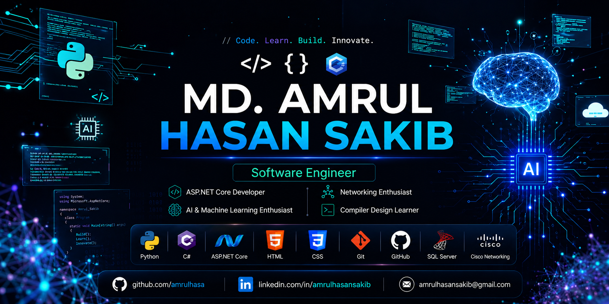

  

<h1 align="center">Hi 👋, I'm Md. Amrul Hasan Sakib</h1>

<h3 align="center">
Software Engineer • ASP.NET Core Developer • AI & Machine Learning Enthusiast
</h3>

I enjoy building scalable backend systems, modern web applications, and AI-powered software solutions.

  

---

### About Me

I am a Computer Science student from Bangladesh passionate about Software Engineering, Artificial Intelligence, and Machine Learning. I love writing clean code, building real-world applications, and continuously improving my skills.

**Focus Areas:**
- ASP.NET Core & Backend Development
- Artificial Intelligence & Machine Learning
- Software Architecture & Clean Code

**Currently Learning:**
- Clean Architecture
- REST API & Entity Framework Core
- System Design
- Deep Learning

---

### Tech Stack

**Languages**  

**Backend**  

**Frontend**  

**Database & Tools**  

---

### Featured Projects

**ASP.NET Core E-Commerce**  
Modern MVC based e-commerce platform with authentication, product management and responsive UI.

**Compiler Design Lexer**  
A lexical analyzer developed in Python for compiler design practice.

**Cisco Packet Tracer Labs**  
Networking laboratory covering Routing, DHCP, DNS, OSPF, RIP and Switching.

---

### GitHub Analytics

  
  

  

  

  

---

### Connect With Me

  
  
  
  

---

  <i>"Learn • Build • Improve"</i>

  Thanks for visiting my profile!

